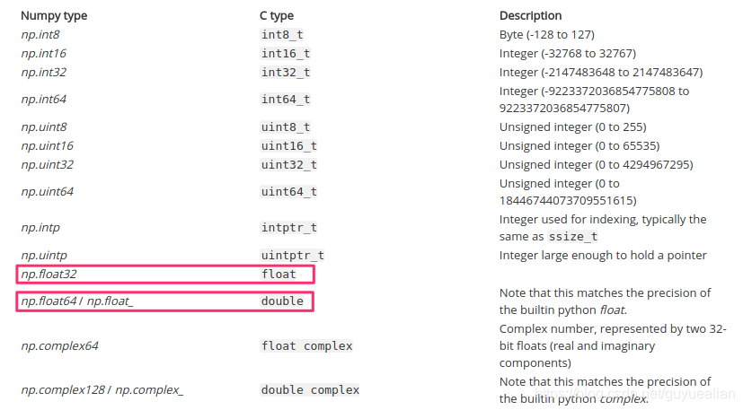

# 结论

Python标准：python默认的float类型是C中的double（64位）

Numpy标准：numpy.float32，约等于C中的float（32位）

<!-- more -->



# 问题被发现的背景

在c++中处理数据，把处理后的数据（c++ float类型）写成二进制文件，再从numpy中把该二进制文件读入且输出。

## 原本的写法

问题现象：c++写出和python读入的数据长度不一样，且python的数据长度是c++的一半。

c++：

```cpp
std::ofstream out_file('./out.dat', std::ios::out | std::ios::binary);
out_file.write((const char*)pos, sizeof(float)*(my_vector.size()));
std::cout << "dat size:" << my_vector.size() << std::endl;
out_file.close();

// output:
// dat size: 786432
```

python：

```python
def read_dat_result(dat_file_name):
    data = np.fromfile(dat_file_name, dtype=float)
    print("numpy dat shape:", data.shape)
    return
  
# output:
# numpy dat shape: 393216
```

## 解决方法

```python
def read_dat_result(dat_file_name):
    # data = np.fromfile(dat_file_name, dtype=float)
    data = np.fromfile(dat_file_name, dtype=np.float32)
    print("numpy dat shape:", data.shape)
    return
  
# output:
# numpy dat shape: 786432
```

